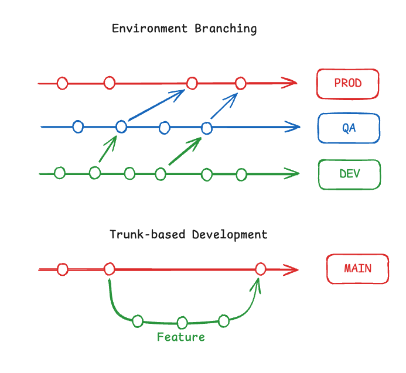

# Our Branching Strategy Journey

Recently, we had a discussion within our platform team about establishing recommendations and then creating documentation for other teams on branching strategies for storing Infrastructure as Code (IaC) files as well as application code. After some interesting and intensive discussions, we agreed on the Trunk-Based branching strategy, following the "Keep It Simple, Stupid" (KISS) approach. I explored this topic extensively and decided to create this note for future reference, which might also be helpful for others. In such decisions, the answer often lies in the specific context and requirements of the project. It depends on factors like team size, project complexity, and the desired pace of delivery. While there is no silver bullet, making a thoughtful decision based on informed discussions is crucial.

# Branching Strategies Compared

There are several branching strategies, ranging from the quite complex (like Git Flow) to the simplest (like Trunk-Based). Other notable strategies include GitHub Flow, GitLab Flow, Environment Branching, and more.

In our case, we focused primarily on storing Infrastructure as Code (IaC) files and, as a result, narrowed our discussion to two strategies: Environment Branching and Trunk-Based. The idea behind Environment Branching was to adopt a secure approach where each environment has its own branch. This allows better control over the source code and releases while reducing the chance of potential bugs. On the other hand, Trunk-Based branching is very simple and, therefore, easy to use. It involves a single main branch where developers integrate their changes continuously, enabling faster delivery and streamlined workflows.

Below is a table comparing the two:
| Aspect                    | Environment Branching                            | Trunk Based                                     |
|---------------------------|--------------------------------------------------|-------------------------------------------------|
| **Complexity**            | High complexity with multiple branches to manage.| Simple, with a single branch as the source of truth. |
| **Collaboration**         | Challenging due to potential conflicts in multiple branches.| Easier, as developers work on a single branch and integrate continuously. |
| **Release Management**    | Easier to control releases for specific environments.| Requires feature toggles and robust CI/CD pipelines for controlled releases. |
| **Bug Tracking**          | Easier to isolate bugs to specific branches/environments.| More challenging, as all changes are in the main branch. |
| **CI/CD Compatibility**   | May require complex pipelines for branch-specific builds.| Simplifies pipelines with a single branch focus. |
| **Scalability**           | Can become difficult to manage with large teams or multiple environments.| Scales well with proper CI/CD practices. |
| **Speed of Delivery**     | Slower, as merging and resolving conflicts can take time.| Faster, with continuous delivery enabling frequent releases. |
| **Learning Curve**        | Steeper, especially for teams unfamiliar with managing multiple branches.| Lower, as it relies on a straightforward workflow. |
| **Code Stability**        | Higher for specific environments but harder to integrate fixes across branches.| Lower initially but improves with robust testing and automation. |
| **Use Case Suitability**  | Best for projects with strict environment segregation or high-risk changes.| Ideal for fast-paced development and teams prioritizing simplicity. |

# Why We Chose Trunk-Based?

To keep it simple, stupid! (KISS) As mentioned at the beginning, there is no silver bullet. Therefore, starting with a simple strategy and adding complexity over time makes sense. Simple solutions are easier to understand and implement, which is especially important when creating recommendations. Although the first option (Environment Branching) was more robust, it was also more complex. This complexity could lead to misunderstandings among teams using it, causing issues with merge conflicts and different code versions across branches. 

# Want to Learn More
For those interested in diving deeper into Git branching strategies, here are some helpful resources I found during my research.
- [Git branching strategy - MS Learn](https://learn.microsoft.com/en-us/azure/devops/repos/git/git-branching-guidance?view=azure-devops)
- [Choosing the Right Git Branching Strategy](https://medium.com/@sreekanth.thummala/choosing-the-right-git-branching-strategy-a-comparative-analysis-f5e635443423)
- [Stop Using Branches for Deploying to Different GitOps Environments](https://codefresh.io/blog/stop-using-branches-deploying-different-gitops-environments/)

